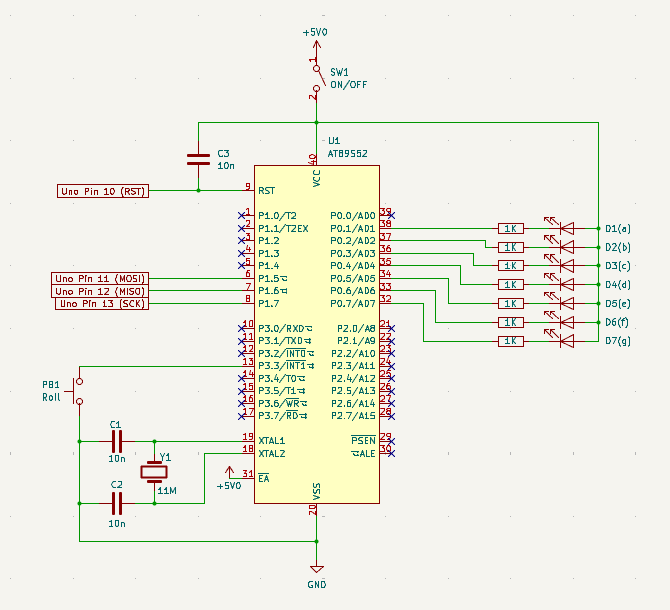
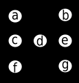
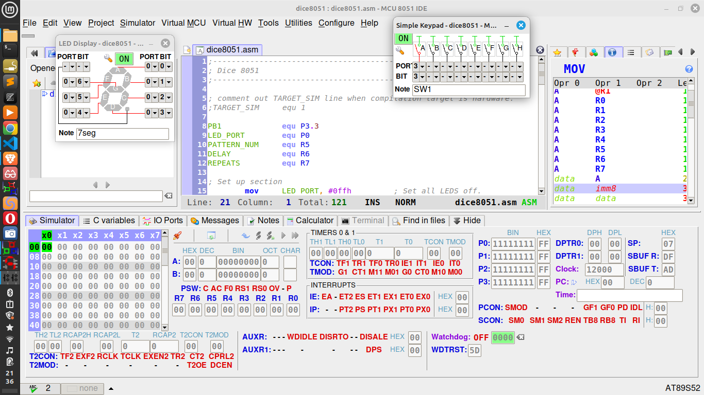

# dice8051
A Dice project implemented on AT89S52 in 8051 assembly.

This is a re-implementation of an original novelty project I designed and built more than 20 years ago - an electronic dice. 

[](https://www.youtube.com/watch?v=nYbFbY3gtLQ)

The original dice project was programmed in 8051 assembly on a 89C1051 microcontroller and had the following elements:

- Use of o/p ports to drive a number of LEDS to show the six dice faces
- Polling an i/p port bit to sense a push button switch press
- A dice 'roll' that counts down through the faces, slowing as it goes before settling on a final face
- A method of pseudo-random number generation
- Modulo 6 counter 
- Bit pattern lookup table for the dice faces
- Software delay
- Subroutine factoring

I expand on some of these below.

For full enlightenment: "Use the source Luke...".

## Circuit Diagram
  

Note: Arduino Uno connections shown are for connection to an Uno used for ISP programming.

## Use of o/p ports to drive a number of LEDs to show the six dice faces
The image below shows the physical position of the display LEDs, identified by letters a to g.

The following table shows the Dice face patterns 1 to 6 and the port bit patterns required to drive the LEDs.

Note, as the LEDs are connected in common anode configuration, the driving bit has to be Low (0) to turn the LED on.

  

|Face|LEDs: &nbsp; g &nbsp; f &nbsp; e &nbsp; d &nbsp; c &nbsp; b &nbsp; a &nbsp; x|Hex|
|-|-|-|
|   |Bits: &nbsp; &nbsp; 1 &nbsp; 1 &nbsp; 1 &nbsp; 0  &nbsp; 1  &nbsp; 1  &nbsp; 1  &nbsp; 1 | 0xEF|  
|   |Bits: &nbsp; &nbsp; 1 &nbsp; 0 &nbsp; 1 &nbsp; 1  &nbsp; 1  &nbsp; 0  &nbsp; 1  &nbsp; 1 | 0xBB|  
|   |Bits: &nbsp; &nbsp; 0 &nbsp; 1 &nbsp; 1 &nbsp; 0  &nbsp; 1  &nbsp; 1  &nbsp; 0  &nbsp; 1 | 0x6D|  
|   |Bits: &nbsp; &nbsp; 0 &nbsp; 0 &nbsp; 1 &nbsp; 1  &nbsp; 1  &nbsp; 0  &nbsp; 0  &nbsp; 1 | 0x39|  
|   |Bits: &nbsp; &nbsp; 0 &nbsp; 0 &nbsp; 1 &nbsp; 0  &nbsp; 1  &nbsp; 0  &nbsp; 0  &nbsp; 1 | 0x29|
|   |Bits: &nbsp; &nbsp; 0 &nbsp; 0 &nbsp; 0 &nbsp; 1  &nbsp; 0  &nbsp; 0  &nbsp; 0  &nbsp; 1 | 0x11|  

Note Port bit 0 \(lsb\) is shown as 'x' as it is not used, I have always set to 1 (just to set it to something).

## Polling an i/p port bit to sense a push button switch press
The program enters a polling loop (PollPB1) that continually polls for the button press:

Code, line 23:
```
pollPB1:
	acall	spin
	jnb 	PB1, go
	sjmp	pollPB1
```
When the button is pressed, it grounds the i/p port pin. The functionality of code line 'jnb PB1,go' is: jump if not bit (jnb) at PB1 to the label go.

In this way, when the button is pressed, it jumps out of the loop to label 'go'.

## Modulo 6 counter
A modulo 6 counter is implemented as follows:

- The counter value is held in processor register R5
- This counter value is initialized to 6 at the start of the program
- Every time subroutine spin is called, it: decrements the count; if the count is zero, it sets it to 6.

In this way, we have a modulo 6 counter, with value available in register R5, that decrements every time subroutine spin is called.

Here are the relevant code lines from the program (see source for full context):

Line 10: allows us to use PATTERN_NUM to mean register R5 in our code
```
PATTERN_NUM	equ R5
```

Line 17: initialize PATTERN_NUM register (R5) to 6
```
	mov	PATTERN_NUM, #06h
```

Line 39: The spin subroutine
```
spin:	
	djnz	PATTERN_NUM, spun	
	mov	PATTERN_NUM, #06h
spun:	
	ret
```

## Software delay
Code line 78:
```
delaySub:
	; Simple short delay suitable for use in simulator.
	mov	A, DELAY
	mov	R1, A
loop:
	mov 	R0, #040h ; #01h for animate, #040h for run
	djnz	R0, $
	djnz 	R1, loop
	ret
```
We create a subroutine (delaySub) that runs down a counter, then returns. The counter takes time to run down, and this produces a 'delay' before the return. The initial value of the counter can be set by first setting the value in register DELAY before calling the subroutine.

Note we have two versions of delay in our code, the simpler one detailed above, which is a short delay suitable for IDE simulation and a much longer one implemented with cascading counters, suitable for the target hardware (one or other is included using the conditional assembly feature of the assembler)

## A method of pseudo-random number generation
As detailed previously, the program enters a polling loop (PollPB1) that continually polls for the button press:  

Code, line 23:
```
pollPB1:
	acall	spin
	jnb 	PB1, go
	sjmp	pollPB1
```
In this loop, it first decrements the modulo 6 counter, then polls the button, then repeats. When the button is pressed, it exits the polling loop. A this point, the modulo 6 counter register has a value in it determined by when the button was pressed. As the loop is very fast, the count value seems to be random (random enough for our purposes).


## Bit pattern lookup table for the dice faces
Code, line 88:
```
getPattern:
	; dice face, com anode, 1 to 6, lsb not used.
	; LEDS:
	; 1   2
	; 3 4 5
	; 6   7
	;
	movc	A, @A+PC
	ret
	; LEDS:	7654321x
	db	11101111b ; 1
	db	10111011b ; 2
	db	01101101b ; 3
	db	00111001b ; 4
	db	00101001b ; 5
	db	00010001b ; 6
```
The subroutine getPattern implements an indexed lookup table. Before we call getPattern, we put an index of value 1 to 6 into the Accumulator then call getPattern. When getPattern is called it returns the value in the db table at that index.
The line that does all of this is 'movc   A, @A+PC'. The functionality of this line is: move into the Accumulator (movc A,) The byte at address 'Here'(PC the current program counter) + offset of value currently in the Accumulator. The next code line is 'ret', i.e. return from subroutine call.  

After the getPattern returns, the bit pattern is now in the Accumulator.

## Software Development Environment
I am using a free IDE called MCU 8051 IDE running on Linux Mint.

I chose this tool as it is free, runs on Linux, has some nice features and is specifically for 8051 development:
- IDE
- Inbuilt Macro Assembler
- Software Simulator 
- Virtual Hardware for Simulation
- Various other useful utils.
- Good documentation

You can write assembly/C code, simulate and debug using the build in simulator and virtual hardware and then produce an intel hex file for download into a target chip.

Screenshot of MCU 8051 IDE:



## Hardware Environment
### Target Chip
The target chip is an AT89S52 chip, which supports ISP programming. I plugged this into a low-cost breakout board (from china) which is convenient as it includes the following on board: Xtal, caps and reset circuitry as well as full pin headers and a power jack with an ON/OFF switch.  

The LEDs and associated resistors I put on a mini breadboard and connected everything up with jumper wires.

### Programmer
I am using an Arduino Uno programmed with the ArduinoISP sketch as the programmer along with free software 
avrdude.

This does require and addition to the avrdude config file to support the AT89S52 chip which I will detail below.

I got this information from various sources on the Web


### Required additions to avrdude config file.
I installed avrdude from the linux repos, and it put the config file here: /etc/avrdude.config  
I added the following snippet right at the top of this file, this worked OK:

<pre>
# MK START ---------------------------------------------------------------------
part
    id               = "89s52";
    desc             = "AT89S52";
    stk500_devcode   = 0xE1;
    signature        = 0x1e 0x52 0x06;
    chip_erase_delay = 500000;
    reset            = dedicated;
    pgm_enable       = "1 0 1 0  1 1 0 0    0 1 0 1  0 0 1 1",
                       "x x x x  x x x x    x x x x  x x x x";

    chip_erase       = "1 0 1 0  1 1 0 0    1 0 0 x  x x x x",
                       "x x x x  x x x x    x x x x  x x x x";

    memory "flash"
        size            = 8192 ;             # bytes
        read            = "0 0 1 0 0 0 0 0  x x x a12 a11 a10 a9 a8",
                          "a7 a6 a5 a4 a3 a2 a1 a0 o o o o o o o o";
        write           = "0 1 0 0 0 0 0 0 x x x a12 a11 a10 a9 a8",
                          "a7 a6 a5 a4 a3 a2 a1 a0 i i i i i i i i";
        ;
    memory "signature"
        size            = 3;
        read            = "0 0 1 0 1 0 0 0  0 0 0 0 0 0 a1 a0",
                          "0 0 0 0 0 0 0 0  o o o o o o  o  o";
        ;
  ;
part parent "89s52"
    id = "89s51";
    desc = "AT89S51";
    signature = 0x1e 0x51 0x06;
    memory "flash"
        size            = 4096 ;             # bytes
        read            = "0 0 1 0 0 0 0 0  x x x x a11 a10 a9 a8",
                          "a7 a6 a5 a4 a3 a2 a1 a0 o o o o o o o o";
        write           = "0 1 0 0 0 0 0 0 x x x x a11 a10 a9 a8",
                          "a7 a6 a5 a4 a3 a2 a1 a0 i i i i i i i i";
      ;
    ;


# NOTE:
#   These definitions below should already be in the avrdude.conf file, but if
# you have problems, just check they are present:
#   #define AT89START   0xE0
#   #define AT89S51     0xE0
#   #define AT89S52     0xE1
# 
# MK END ---------------------------------------------------------------------
</pre>  

### Avrdude commands

Avrdude has a terminal interface by default and the commands I used for target chip errase  
and programming are as follows:  

```
~$ avrdude -c stk500v1 -P /dev/ttyACM0 -p 89s52 -b 19200 -e

~$ avrdude -c stk500v1 -P /dev/ttyACM0 -p 89s52 -b 19200 -U flash:w:<myfile>.hex:i

```
In terminal, type avrdude --help and man avrdude for docs
